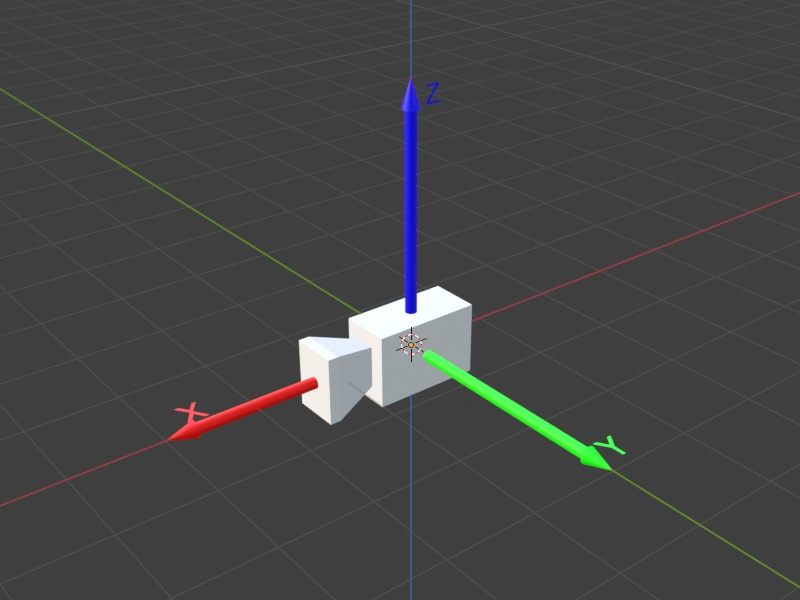
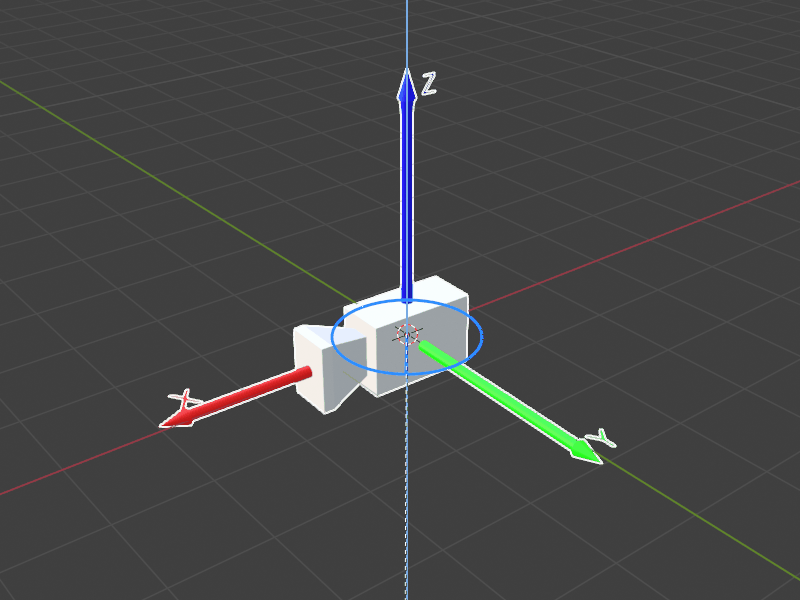
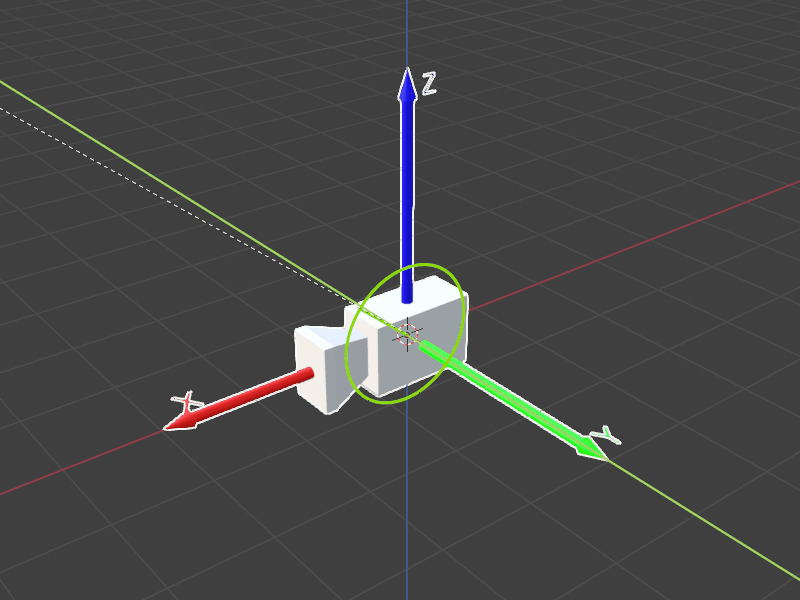
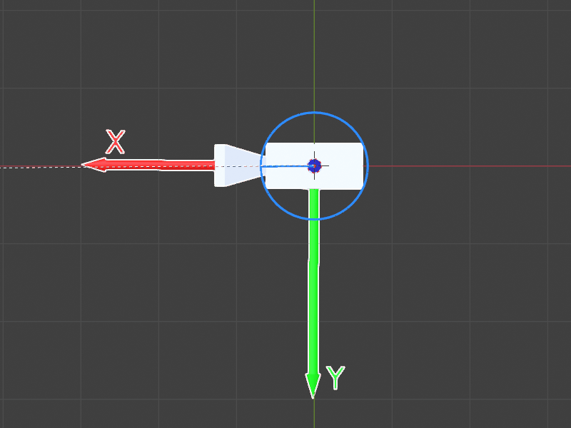
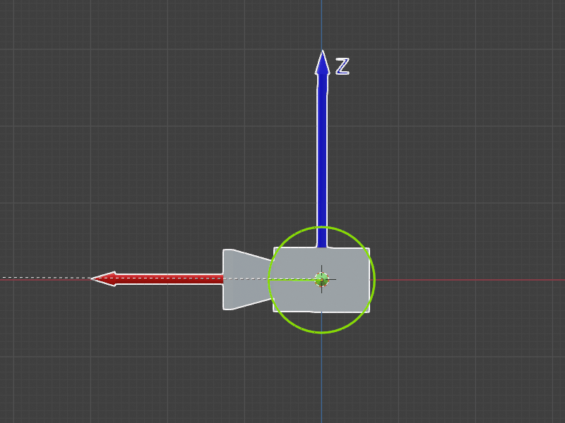

# Projekt Scorpio - zadanie rekrutacyjne do działu Software

> **Uwaga!** Przed przystąpieniem do realizacji zadania przeczytaj **całe** README i pamiętaj, żeby wypełnić [formularz rekrutacyjny](https://docs.google.com/forms/d/e/1FAIpQLSejymgG4B_sdydx00Q5eeRah45qMMkzDeamQehD1HjqQF-UJw/viewform?usp=header).

## Spis treści
- [Informacje ogólne](#informacje-ogólne)
- [Zadania do wykonania](#zadania-do-wykonania)
- [Specyfikacja techniczna zadania](#specyfikacja-techniczna-zadania)
  - [Symulacja](#symulacja)
  - [Dokumentacja API](#dokumentacja-api)
  - [Dokumentacja argumentów CLI](#dokumentacja-argumentów-cli)
- [Wskazówki i przydatne linki](#wskazówki-i-przydatne-linki)

## Informacje ogólne
Zadanie wykorzystuje symulację dwu-osiowej platformy obrotowej, w której za pomocą stworzonego przez nas API można sterować dwoma silnikami oraz dokonywać odczytu wartości ich enkoderów liniowych (wytłumaczenie, czym jest enkoder znajdziesz w tym [artykule](https://stoltronic.pl/pl/blog/post/43/enkoder-zasada-dzialania-rodzaje-budowa?page_type=post)). Silnik numer 1 jest odpowiedzialny za ruch w osi poziomej, zaś numer 2 w pionowej.

Uznajemy, na potrzebę zadań, że na osi pionowej zamontowana jest kamera, którą możemy się rozglądać sterując silnikami.

Całość zadania należy wykonać w języku C++, zgodnie ze standardem C++17.

Rozwiązane zadanie należy umieścić w **publicznym** repozytorium (np. GitHub) i przesłać linka do tego repozytorium na mail projekt@scorpio.pwr.edu.pl. Ewentualne pytania lub wątpliwości co do treści zadania można kierować na tego samego maila. Zadania przyjmujemy do 11.11.2025 do końca dnia.

## Zadania do wykonania 
W tej części znajdziesz treść poszczególnych zadań. Szczegółowe informacje dotyczące symulacji oraz jej implementacji znajdziesz w sekcji [specyfikacja techniczna zadania](#specyfikacja-techniczna-zadania).

Pamiętaj, że zadanie służy sprawdzeniu wielu umiejętności - nie tylko programowania i znajomości algorytmów -  więc nawet w przypadku zrealizowania tylko części z poniższych punktów, zachęcamy do przesłania rozwiązania. Postępy w zadaniu powinny być udokumentowane w repozytorium na githubie (po każdym etapie zadania powinien zostać stworzony nowy commit).

1. **Zbudowanie projektu:**

- Dokonaj fork'a tego repozytorium i go sklonuj komendą `git clone <URL zforkowanego repo>`.
- Skonfiguruj środowisko i upewnij się, że projekt kompiluje się przy użyciu `CMake`:

---

| Krok | Linux (bash) | Windows (PowerShell / cmd) |
|------|--------------|----------------------------------------------|
| 1. Wejście do repo | `cd scorpio_zadanie_rekrutacyjne_software` | `cd scorpio_zadanie_rekrutacyjne_software` |
| 2. Utwórz katalog build | `mkdir build && cd build` | `mkdir build && cd build` |
| 3. Generuj pliki przez CMake | `cmake ..` | `cmake ..` |
| 4. Budowanie | `cmake --build .` | `cmake --build . --config Release` |
| 5. Uruchom program | `./scorpio_recruitment_task` | `.\Release\scorpio_recruitment_task.exe` |

---

- W uruchomionym programie zadaj cel za pomocą wiersza poleceń, np: `5 3 4 5`. Wyjaśnienie tego, co oznaczają poszczególne liczby znajdziesz w sekcji [wprowadzanie celów](#wprowadzanie-celów).
- Za pomocą `Ctrl+D` zakończ wprowadzanie celów. Gdy zaimplementujesz swoje rozwiązanie, to po wciśnięciu `Ctrl+D` zadane punkty zostaną mu przekazane. Na tym etapie zostanie wykonany przykład zawarty w funkcji `solver()` w `/src/solution/solution.cpp`.

2. **Dojazd do pojedyńczego celu**

- Zostanie Ci przesłany pojedyńczy punkt. Należy obrócić obydwoma silnikami tak, aby kamera patrzyła na ten punkt.

Przykład testowy:

```bash
0 1 1 0
```

> **Wskazówka!** Żeby nie wprowadzać danych za każdym razem, możesz przekleić przykład testowy do pliku i wykorzystać flagę `-f` udokumentowaną w sekcji [dokumentacja argumentów CLI](#dokumentacja-argumentów-cli) 

> **Wskazówka!** W sekcji [symulacja](#symulacja) znajdziesz dokładny opis platformy obrotowej.

3. **Dojazd do wielu celów (priorytet ostatniego)**

- Zostanie przesłana arbitralna liczba punktów w odstępach niewiększych niż 10 sekund. Każdy punkt należy obsłużyć dokładnie tak jak w poprzednim zadaniu. Jeżeli podczas dojazdu do celu zostanie zadany kolejny cel, należy obecny cel porzucić.
- W tym zadaniu należy uruchamiać program z flagą `-p`.

Przykład testowy:

```bash
0 1 1 0
10 1 1 1
1 -1 0 0
3 1 1 0
```

> **Wskazówka!** Pamiętaj o regularnym commitowaniu rozwiązania.

4. **Dojazd do wielu celów (kolejka)**

- Zostanie przesłana arbitralna liczba punktów w odstępach niewiększych niż 10 sekund. Należy każdy z tych punktów obsłużyć dokładnie tak jak w poprzednim zadaniu, dojeżdżając do każdego po kolei, bez wywłaszczenia.
- W tym zadaniu **nie należy** używać flagi `-p`.

Przykład testowy:

```bash
0 1 1 0
10 1 1 1
1 -1 0 0
3 1 1 0
```

> **Wskazówka!** Oczekujemy, że sam określisz margines dojechania do celu.

## Specyfikacja techniczna zadania

### Symulacja

#### Wstęp

W tej symulacji operujemy dwoma układami współrzędnych: globalnym (nieruchomy, który opisuje całą przestrzeń, w której porusza się kamera) oraz lokalnym kamery (który obraca się wraz z nią). Wyobraź sobie, że kamera siedzi w punkcie (0,0,0) i może obracać się w poziomie i w pionie - w praktyce nie musimy martwić się fizycznymi wymiarami statywu czy samej kamery, czyli tak naprawdę „kamera wisi w miejscu, a silniki zmieniają jej kierunek patrzenia”.

Silnik 1 odpowiada za obrót w poziomie (jakbyś obracał głowę w lewo i w prawo), a silnik 2 za ruch w pionie (góra-dół). Aby wiedzieć, w jakim kierunku patrzy kamera, korzystamy z enkoderów - to cyfrowe liczniki, które mówią nam, o ile stopni obrócił się dany silnik (zakodowane jako wartość z zakresu [0; 4095]). Symulacja nie zajmuje się mechanicznymi detalami montażu - liczy się tylko matematyka obrotów i przesyłanie odpowiednich sygnałów do silników, tak aby kamera mogła „wycelować” w wskazany punkt w przestrzeni.

#### System współrzędnych i mapowanie enkoderów

Symulacja implementuje dwu-osiową platformę obrotową z następującym układem współrzędnych:

<div style="display: flex; justify-content: center; gap: 10px;">
  
</div>

Na powyższym diagramie kamera znajduje się w pozycji początkowej `(0,0,0)`. Pogrubione osie są osiami układu kamery, zaś cieńkie są osiami układu globalnego. W tej pozycji odczyty z enkoderów będą, dla obu silników, równe 0.

Silnik 1 - Oś pozioma:
- Wartość = 0 → kamera skierowana w kierunku +X
- Wartość rosnąca → silnik kręci się zgodnie z ruchem wskazówek zegara
- Steruje obrotem w okół osi Z globalnego układu współrzędnych (cienka niebieska oś)

<div style="display: flex; justify-content: center; gap: 10px;">
  
</div>

Powyższy gif jest wizualizacją sterowania silnikiem 1. Jak widać, obrót odbywa się w okół globalnej (cienkiej) osi pionowej.

Silnik 2 - Oś pionowa:
- Wartość = 0 → kamera skierowana poziomo, równolegle do ziemi (płaszczyzny XY).
- Wartość rosnąca → silnik kręci się do góry
- Steruje obrotem w okół osi Y układy współrzędnych kamery (pogrubiona zielona oś)

<div style="display: flex; justify-content: center; gap: 10px;">
  
</div>

Powyższy gif jest wizualizacją sterowania silnikiem 2. Jak widać, obrót odbywa się w okół osi Y układu kamery (pogrubionej).

<div style="display: flex; justify-content: center; gap: 10px;">
  
  
</div>

Powyższe gify, odpowiednio dla silników 1 i 2, obrazują narastanie wartości enkoderów, zaczynając od 0. Tzn. na początku odczyt będzie równy 0 i wraz z czasem będzie rósł.

#### Charakterystyka ruchu

Sygnały sterujące:
- Wartości dodatnie (1-127): ruch w kierunku rosnących wartości enkodera
- Wartości ujemne (-128 do -1): ruch w kierunku malejących wartości enkodera
- Wartość 0: brak ruchu

Właściwości enkoderów:
- Zakres: 0-4095 (12-bit, cykliczny)
- Cykliczność: enkodery są cykliczne, po pełnym obrocie do 4095 kolejną wartością będzie 0
- Rozdzielczość: 4096 pozycji na pełny obrót (360°)
- Drgania: silnik (co za tym idzie, odczyt enkodera) drga stojąc w miejscu
- Częstotliwość odczytu: konfigurowalna (domyślnie 20 Hz)

### Dokumentacja API

> **Uwaga!** Nie należy modyfikować implementacji symulacji. Całe twoje rozwiązanie powinno znaleźć się w katalogach `*/solution`, a punktem wejściowym twojego rozwiązania powinna być funkcja `solver()` w pliku `solution.cpp`.

#### Interfejs `Tester`

Interfejs `backend_interface::Tester` zapewnia dostęp do symulacji dwu-osiowej platformy obrotowej. Pozwala na sterowanie silnikami oraz odbieranie celów.

Składniki:
- `get_motor_1()` - zwraca komponent odpowiadający za komunikację z silnikiem osi poziomej
- `get_motor_2()` - zwraca komponent odpowiadający za komunikację z silnikiem osi pionowej
- `get_commands()` - zwraca komponent do odbierania celów

#### Funkcja `solver(tester, preempt)`

Parametr `tester` daje Ci dostęp, zgodnie z powyższym opisem, do komponentów potrzebnych do rozwiązania zadania. Flaga boolowska `preempt` określa, czy włączony jest tryb wywłaszczania celu, czy nie (odpowiednio do zadania 3 i 4).

#### Interfejs `Component`

Wszystkie komponenty implementują interfejs `Component<Send, Receive>`, który udostępnia możliwość pracy w modelu publisher/subscriber:

```cpp
template <typename Send, typename Receive>
class Component {
  public:
  virtual void add_data_callback(std::function<void(const Receive&)>) = 0;
  virtual void send_data(const Send&) = 0;
};
```

W skrócie, za pomocą `send_data()` wysyłamy dane do komponentu, a za pomocą `add_data_callback()` możemy ustawić callback dla komponentu (wyjaśnione później)

> **Uwaga!** Nie oczekujemy, na tym etapie, że rozumiesz co dokładnie oznacza każde słowo w powyższym kodzie. Poniżej, oraz w funkcji `solver()`, znajdziesz przykłady, na podstawie których powinieneś z łatwością mógł przystąpić do implementacji rozwiązania.

#### Silniki (`Component<int8_t, uint16_t>`)

Wysyłanie sygnału sterującego:
```cpp
auto motor1 = tester->get_motor_1();
motor1->send_data(100);  // Wartość z zakresu [-128; 127]
```

Odbieranie pozycji enkodera:
```cpp
motor1->add_data_callback([](const uint16_t& encoder_value) {
    std::cout << "Pozycja enkodera: " << encoder_value << std::endl;
});
```

*lub analogicznie:*

```cpp
void encoder_callback(const uint16_t& encoder_value) {
  std::cout << "Pozycja enkodera: " << encoder_value << std::endl;
}

motor1->add_data_callback(encoder_callback);
```

W skrócie, callback to funkcja, która jest wywoływana w momencie określonego zdarzenia, z konkretnymi parametrami tego zdarzenia. W tym wypadku enkoder co odczyt wywoła podany callback z wartością odczytu. Powyższe dwie implementacje zachowają się identycznie.

> **Wskazówka!** Jeżeli callback silnika będzie wykonywał się dłużej niż okres aktualizacji enkodera, to program zakończy się błędem. Callbacki powinny być małymi, "tanimi" funkcjami.

Charakterystyka silników:
- Typ sygnału sterującego: `int8_t` (zakres: -128 do 127)
- Typ odczytu enkodera: `uint16_t` (zakres: 0 do 4095)

#### Polecenia (`Component<Impossible, Point>`)

Odbieranie poleceń pozycji:
```cpp
auto commands = tester->get_commands();
commands->add_data_callback([](const Point& target) {
  std::cout << "Cel: x=" << target.x 
            << " y=" << target.y 
            << " z=" << target.z << std::endl;
});
```

Struktura `Point`: <br>
Reprezentuje punkt w przestrzeni trójwymiarowej.

```cpp
struct Point {
  double x;  // Współrzędna X
  double y;  // Współrzędna Y  
  double z;  // Współrzędna Z
};
```

**Uwagi:**
- Polecenia są wysyłane automatycznie przez symulator zgodnie z danymi wejściowymi
- Typ `Impossible` uniemożliwia wysyłanie danych do komponentu poleceń

### Dokumentacja argumentów CLI

Program symulacji platformy obrotowej obsługuje następujące argumenty wiersza poleceń:

#### Dostępne opcje

| Opcja | Argument | Opis |
|-------|----------|------|
| `-h` | - | Wyświetla wiadomość pomocy z listą wszystkich dostępnych opcji |
| `-f` | FILE | Odczytuje dane wejściowe z podanego pliku zamiast ze standardowego wejścia |
| `-g` | - | Włącza tryb debugowania (verbose output) |
| `-p` | - | Włącza tryb wywłaszczania (potrzebny do zadania 3)
| `-q` | PERIOD | Ustawia okres aktualizacji enkoderów (w sekundach) |

#### Przykłady użycia

```bash
# Uruchomienie z domyślnymi ustawieniami
./scorpio_recruitment_task

# Uruchomienie z plikiem wejściowym
./scorpio_recruitment_task -f commands.txt

# Uruchomienie z szybszym odświeżaniem enkoderów
./scorpio_recruitment_task -q 0.01
```

#### Wprowadzanie celów

Format pojedyńczego celu jest następujący:
`<delay> <X> <Y> <Z>`

- `delay` -> określa w jakim odstępie czasowym od poprzedniego celu zostanie zadany ten cel
- `X`, `Y`, `Z` -> współrzędne celu w przestrzeni 3D

Przykład:

```shell
5 1 2 3 # (1,2,3) zadany po 5 sekundach działania symulacji
5 5 5 5 # (5,5,5) zadany po kolejnych 5 sekundach
10 9 8 7 # (9,8,7) zadany po kolejnych 10 sekundach
1 2 3 4 # (2,3,4) zadany po kolejnej sekundzie
```

## Wskazówki i przydatne linki

- [Czym jest enkoder](https://stoltronic.pl/pl/blog/post/43/enkoder-zasada-dzialania-rodzaje-budowa?page_type=post)
- Zadanie rekrutacyjne można oddać niepełne.
- Rozwiązane zadanie należy umieścić w **publicznym** repozytorium (np. GitHub) i przesłać linka do tego repozytorium na mail projekt@scorpio.pwr.edu.pl. Ewentualne pytania lub wątpliwości co do treści zadania można kierować na tego samego maila. Zadania przyjmujemy do 11.11.2025 do końca dnia.

**Jeżeli będziesz miał jakiekolwiek wątpliwości i problemy z zadaniem śmiało skontaktuj się z nami na maila projekt@scorpio.pwr.edu.pl! Powodzenia :)**